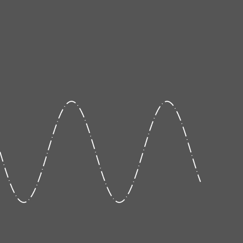

# Dashed line compiler

Class for compiling dashed lines/polylines.
It is platform and drawing framework independent class for generating set of point coordinates for plotting dashed polylines usin simple solid line primitives.

# Build demo

tested using vs2022
blend2d used to generate result image, it may be shanged with any you want.